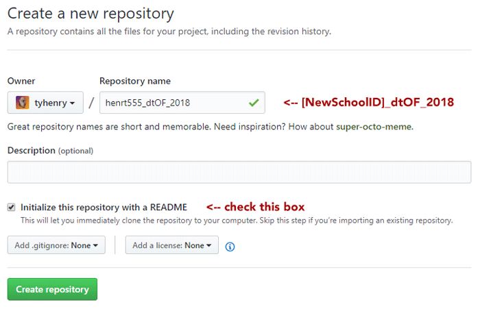

# Setup

There are 5 main steps:

 1. [Download openFrameworks](#1-download-openframeworks)
 2. [Install your IDE (Xcode or Visual Studio)](#2-install-your-ide)
 3. [Install Git](#3-install-git)
 4. [Clone this Git repo](#4-clone-this-git-repository)
 5. [Create your Git account and your homework repo](#5-create-a-github-account-and-make-a-new-repository-for-your-homework)


## 1. Download openFrameworks

Go to [openFrameworks.cc/download](http://openframeworks.cc/download/) and download the OF version that matches your platform (Mac, Windows, or Linux).

Unzip this file. You'll see a folder like `of_v0.10.0_osx_release`, which contains everything you need to use openFrameworks. 

I recommend placing OF on your Desktop so it's easily accessible, i.e. `~/Desktop/of_v0.10.0_osx_release`.  You can also rename the folder to something nicer like `~/Desktop/openFrameworks` if you want.


## 2. Install your IDE

Your IDE - "integrated development environment" - is a glorified text editor, with a built-in compiler to run your apps.  It's where you will write your code and build your openFrameworks applications.

### macOS:
Use **Xcode** as your IDE. [Follow these instructions](http://openframeworks.cc/setup/xcode/) to get set up.  

### Windows:
Use **Visual Studio Community 2017**.  [Follow these instructions](http://openframeworks.cc/setup/vs/) to get set up.  


## 3. Install Git

Git is the "version control" software we will use to keep track of our code and share it with each other.  
Git runs on your computer, and allows you to sync your files with [Github.com](https://github.com/join).

__We will use Git on the command line (i.e. through Terminal on a Mac).__

Here's how to install Git:

### macOS:

On Mac, you'll want to install the [Homebrew](http://brew.sh/) package manager first, which will allow you to easily keep Git up to date.

1. **Install Homebrew**  
    Follow the simple instructions at the [Homebrew website](https://brew.sh/): 
    
    _Open Terminal, and paste in this line:_
    
        /usr/bin/ruby -e "$(curl -fsSL https://raw.githubusercontent.com/Homebrew/install/master/install)"
    

2. **Then install Git**
     _In Terminal, type:_ 
        
        brew install git

### Windows:

Download the Git installer from [the Git website](https://git-scm.com/download/win).  
This will install Git, as well as __Git Bash__, which you will use as your command line interface to control Git.


## 4. Clone this Git repository

Open the command line (__Terminal__ on Mac, or __Git Bash__ on Windows), and navigate to your openFrameworks root directory. For instance, type:

    cd ~/Desktop/openFrameworks
    
(or replace `~/Desktop/openFrameworks/` with your openFrameworks folder path).

Now clone this repository:

    git clone https://github.com/tyhenry/dt_openframeworks_2018.git

You will see that the folder appears next to the `apps/` and `addons/` folders, i.e.

```
openFrameworks/
  addons/
  apps/
  docs/
  dt_openframeworks_2018/
  examples/
  etc.../
```

This folder structure allows you to easily build the example applications from the `dt_openframeworks_2018` repo.


## 5. Create a GitHub account, and make a new repository for your homework

[GitHub](https://github.com/join) is the most popular website for hosting code.  
Git + GitHub is the system we'll use to share example code, and how you'll submit homework.

### 1. Sign up:  
  You need to [sign up for a free account at GitHub.com](https://github.com/join) if you don't have an account already.

### 2. Create your homework repo:   
  Now create a repository for your homework on GitHub.  
  To create a new repo, click the **[+]** symbol in the upper right of the webpage.  

  **IMPORTANT:**
  Name your homework repo as follows:
  **`[Your New School ID]_dtOF_2018`** (example: **`henrt555_dtOF_2018`**)
    
  
       
### 3. Clone your new repo to your computer: 

  - First, copy the repo address given to you by GitHub  
    (e.g. `https://github.com/tyhenry/henrt555_dtOF_2018.git`) 

  

  - Then, in **Terminal** (or **Git Bash** on Windows):  
    Navigate to your `openFrameworks/apps/` folder.  
    Then type `git clone ` and paste the address, e.g.:   
    
        cd ~/Desktop/openFrameworks/apps/ 
        git clone https://github.com/tyhenry/henrt555_dtOF_2017.git

  This will create your homework repo folder inside `openFrameworks/apps/`.  
  This is where you will create your openFrameworks homework sketches using **OF Project Generator**.
  
  **IMPORTANT:**  
  You must organize your sketches by naming them as follows:  
  **`[WEEK NUMBER]_[HOMEWORK NUMBER]_[APP NAME]`**

  For example:

  ```
  openFrameworks/
    addons/
    apps/
      henrt555_dtOF_2018/
        w01_h01_helloWorld/
        w01_h02_myFancyApp/
        w02_h01_goToTen/ 
        w03_h01_nandNor/ 
        etc…/
    docs/
    dt_openframeworks_2018/
    examples/
    etc.../
  ```


### 4. Add .gitignore file:

  To keep your homework repo nice and neat, you need to add a **`.gitignore`** file to your folder.  
  This file tells Git what file types you __don't__ want to track and send to GitHub. 
    
  Copy the [.gitignore](https://raw.githubusercontent.com/tyhenry/dt_openframeworks_2018/master/.gitignore) file from the **`dt_openframeworks_2018`** repo folder to your homework folder. 

  _Note:_ To see this file in Mac Finder or Windows Explorer you need to enable the **show hidden files** setting:  
   *  On macOS (Sierra and later), open Finder and press: **`CMD + SHIFT + .`**
   *  On Windows 10, open Explorer, click the `View` tab, and check **`[x] Hidden items`**

  You can also use the command line to copy the file (in **Terminal** or **Git Bash**), e.g.:  

  ```shell
  cd ~/Desktop/openFrameworks/apps/henrt555_dtOF_2018 
  cp ../../dt_openframeworks_2018/.gitignore .
  ```

